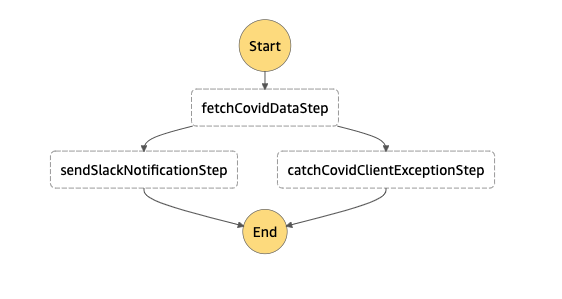
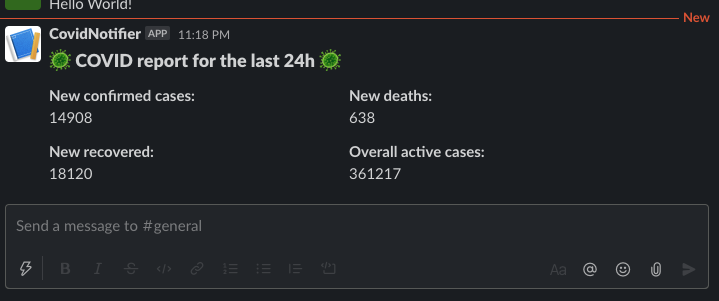

## Simple application for getting daily COVID stats for Poland and sending slack notification using Serverless Framework and AWS Step Functions

Application has AWS EventBridge configured with daily COVID data submission at 12 PM UTC timezone.
However, app can be triggered manually from AWS Step Functions -> State Machines tab.
If you don't want EventBridge event, remove `events` section from `serverless.ts` for `CovidNotificationStateMachine`

**Important: Before running the app, provide `slackNotificationWebhookUrl` value inside `serverless.ts`**

### Deploying app
```bash
sls deploy
```
_Note: make sure to export your AWS_PROFILE or use `aws-profile` option_

### Running specific functions locally:
1. **fetchCovidData**
```bash
sls invoke local -f fetchCovidData
```
2. **sendSlackNotification**
```bash
sls invoke local -f sendSlackNotification --path data/event/new-covid-day-stats.json
```

### State Machine Chart

### Sack Notification

